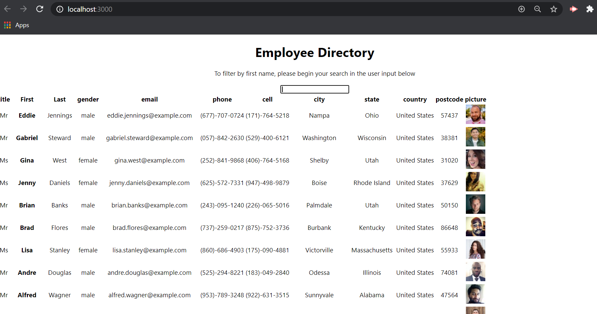
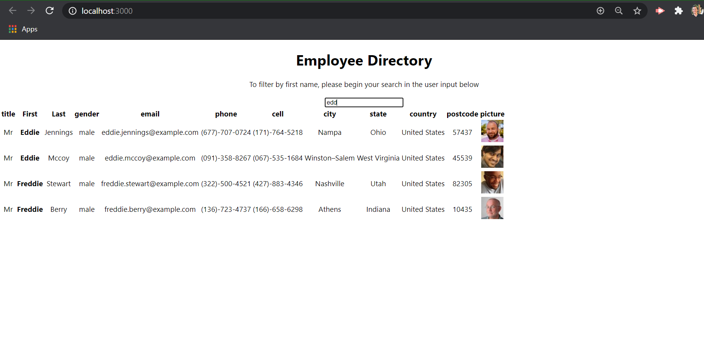

# user-directory-reactapp

## User Story
As a USER
I WANT to be able to view my entire employee directory at once so that I have quick access to their information.

Description: The User Directory app solves the real world problem of keeping track of your employees by filtering first names. The app integrates a React, service worker, and axios. The  motivation to build this project was to help clients achieve their directory organizatio goals by having an accessible website that is easy to navigate. Having filtering functionality is paramount to our applications success. An employee or manager would benefit greatly from being able to view this employee directory. It would be particularly helpful to be able to filter employees by first name.

Technologies used: React JS, service worker, axios, react-dom, react-scripts. 

Challenges:  The filtering function was quite a challenge. 

Future development: Have more filtering options like last name, City etc. 

Installation: clone repo and  'npm install' and 'npm start'

Run: Using Chrome or a favorite browser copy link https://localhost:3000/ 

Deployed: https://aqueous-sierra-39120.herokuapp.com/

Authors and acknowledgment: Developed by Melanie Cisler

